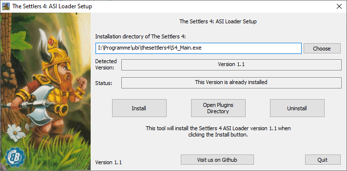

# The Settlers 4: ASI Loader 

This is a tool which adds ASI plugin loading functionality to The Settlers 4. You need it to install mods to your game as the game does not come with modding support by default.

There is a [German translation for this README](README_DE.md). Please note that it may be outdated.

## Features

* Enables the usage of ASI Plugins to extend the game.
* Works with Gold Edition as well as with the History Edition of The Settlers 4.
* Compatible with Windows XP or later.

## Installation

1. Download a [release](https://github.com/nyfrk/Settlers4-ASI-Loader/releases) and run the `S4_ASI.exe`.
2. Choose your settlers 4 installation directory by selecting your S4_Main.exe. If you have the history edition installed skip this step.
3. Click Install
4. Click Open Plugins Directory to find the directory for your plugins. The loader will only pick up plugins with the .asi ending. It will load them in alphabetical order.

## Issues and Questions

The project uses the Github Issue tracker. Please open a ticket [here](https://github.com/nyfrk/Settlers4-ASI-Loader/issues). 

## Plugins

Here is a list of plugins that you can install to The Settlers 4. You can add your plugin to this list. However, the only requirement is, that it is compatible with the latest Gold Edition AND the History Edition of the game. 

* [Unlimited Selections Mod](https://github.com/nyfrk/Settlers4-UnlimitedSelectionMod) by [nyfrk](https://github.com/nyfrk): Remove the selection limit of your units and add additional selection filtering means.
* [Settler Limit Remover Mod](https://github.com/nyfrk/S4_SettlerLimitRemover) by [nyfrk](https://github.com/nyfrk): Produce as much settlers as you want.
* [Texture Changer](https://github.com/nyfrk/Settlers4-TextureChanger) by [nyfrk](https://github.com/nyfrk): Play always with the New World textures.
* [Ferry Limit Customizer](https://github.com/nyfrk/FerryLimitCustomizer) by [nyfrk](https://github.com/nyfrk): Increase the capacity of your ferries.

## Contribute

The official repository of this project is available at https://github.com/nyfrk/Settlers4-ASI-Loader. You can contribute in the following ways:

* Answer questions
* Submit bugs or help to verify them
* Review code and test the proposed fixes
* Submit pull requests
* Create or submit plugins

#### Compile it yourself

Download Visual Studio 2017 or 2019 with the C++ toolchain. The project is configured to build it with the Windows XP compatible **v141_xp** toolchain. However, you should be able to change the toolchain to whatever you like. No additional libraries are required so it should compile out of the box. 

#### Developers

The loader is a proxy dll of the binkw32.dll. It is well suited as a proxy target as the Gold Edition and the History Edition use the very same binkw32.dll and because it only epxorts just a few stdcall functions. Note that ASI Plugins are just regular DLLs with the .asi file ending. These DLLs however usually apply their mods within their DllMain function. When creating a plugin do not assume any loading state when the loader loads your plugin. If you depend on a module (DLL) use LoadLibrary to load it yourself.

#### Future work

* Add improved crash dumps like [Ultimate ASI Loader](https://github.com/ThirteenAG/Ultimate-ASI-Loader) does. (The regular fatal error boxes are useless)

## License

The project is licensed under the [MIT](LICENSE.md) License. 
