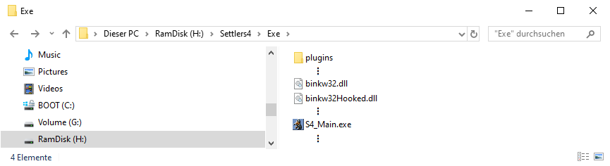

# Die Siedler 4: ASI-Loader

Dieses Tool ermöglicht es ASI-Plugins in Die Siedler 4 oder jedem anderen Spiel, das die gleiche binkw32.dll verwendet, zu laden.

Für dieses README gibt es eine [englische Version](README.md). Bitte beachte, dass die deutsche Übersetzung ggf. veraltet sein kann.

## Features

* Funktioniert sowohl mit der Gold Edition als auch mit der History Edition von Die Siedler 4.
* Kompatibel mit Windows XP oder neuer.

## Installation

1. Navigiere zum Installationsverzeichnis des Spiels. 
2. Suche eine Datei namens `binkw32.dll` und benennen sie in `binkw32Hooked.dll` um. (Bei der Gold Edition befindet sie sich in einem Unterverzeichnis namens `Exe`)
3. Lade ein [Release](https://github.com/nyfrk/Settlers4-ASI-Loader/releases) herunter und entpacke die `binkw32.dll` in dasselbe Verzeichnis.
4. Erstellen ein Verzeichnis namens `plugins` neben der `S4_Main.exe`.
5. Verschiebe Deine ASI-Plugins in das Verzeichnis `plugins`, um sie zu aktivieren. Der Loader wird nur Plugins mit der Endung .asi beim Starten des Spiels laden.

Nach diesen Schritten sollte Dein Installationsverzeichnis wie folgt aussehen:

Beachte, dass wenn Windows die Dateiendungen (wie .dll) nicht anzeigt, Du diese einfach ignorieren kannst. In diesem Fall sollte die Datei zum Beispiel einfach `binkw32Hooked` genannt werden.

## Probleme und Fragen

Das Projekt verwendet den Github Issue Tracker. Bitte öffne [hier](https://github.com/nyfrk/Settlers4-ASI-Loader/issues) ein Ticket für dein Anliegen.

## Plugins

Hier ist eine Liste von bekannten Plugins, die Du für Die Siedler 4 installieren kannst. Du kannst ein Plugin zu dieser Liste hinzufügen. Die einzige Voraussetzung ist jedoch, dass es mit der neuesten Gold Edition UND der History Edition des Spiels kompatibel ist. 

* [Unbegrenzte Auswahllimit Mod](https://github.com/nyfrk/Settlers4-UnlimitedSelectionMod) von [nyfrk](https://github.com/nyfrk): Entferne das Auswahllimit Deiner Einheiten und füge zusätzliche Auswahlfilteroptionen hinzu.

## Beitragen

Das offizielle Repository dieses Projekts ist unter https://github.com/nyfrk/Settlers4-ASI-Loader verfügbar. Du kannst auf die folgenden Arten einen Beitrag leisten:

* Beantworte Fragen
* Fehler melden oder bei der Verifizierung dieser helfen
* Code sichten und die vorgeschlagenen Korrekturen testen
* Pull Requests einreichen
* Plugins erstellen oder einreichen (um sie der Liste hinzuzufügen)

##### Kompilieren

Lade Visual Studio 2017 oder 2019 mit der C++-Toolchain herunter. Das Projekt ist so konfiguriert, dass es mit der Windows XP-kompatiblen **v141_xp**-Toolchain gebaut wird. Du solltest jedoch die Toolchain nach Belieben ändern können. Es sind keine zusätzlichen Bibliotheken erforderlich, sodass das Projekt ohne weiteres gebaut werden kann.

##### Entwickler

Der Loader ist eine Proxy-Dll der binkw32.dll. Sie eignet sich gut als Proxy-Ziel, da die Gold Edition und die History Edition die gleiche binkw32.dll verwenden und weil sie nur einige wenige stdcall-Funktionen epxortiert. Beachte, dass ASI-Plugins im Grunde nur reguläre DLLs mit der Dateiendung .asi sind. Diese speziellen DLLs wenden jedoch normalerweise ihre Mods innerhalb ihrer DllMain-Funktion an. Nimm beim Erstellen eines Plugins keinen bestimmten Ladezustand an. Wenn Du auf ein Modul (DLL) angewiesen bist, verwenden LoadLibrary, um es selbst zu laden.

##### Zukünftige Arbeit

* Verbesserte Crash-Dumps, wie es [Ultimate ASI Loader](https://github.com/ThirteenAG/Ultimate-ASI-Loader) tut. (Die üblichen Fatal Error Meldungen sind nutzlos) 
* Sortieren der Plugins nach Dateinamen vor dem Laden (Damit die Plugins in vorhersehbarer Reihenfolge geladen werden)

## Lizenz

Das Projekt ist unter der [MIT](https://github.com/nyfrk/Settlers4-UnlimitedSelectionMod/blob/master/LICENSE.md)-Lizenz lizenziert.
